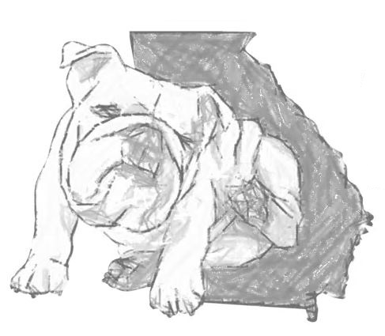

```{r UGA_itchybulldog, out.width='55%', fig.align='center', echo=FALSE}

```

### Thank you for visiting the Banovic Labs Website: a research lab in the [Small Animal Medicine and Surgery (SAMS) department of the University of Georgia (UGA) College of Veterinary Medicine (CVM)](https://vet.uga.edu/education/academic-departments/small-animal-medicine-and-surgery/) in Athens Georgia, USA
<br>

### Our lab focuses on dermatological studies for **many** species, from murine to equine, feline, canine, and including human. 
<br>

#### Frequently, dermatologically (and often immunologically), diseases present with phenotypical _and_ cellular molecular similarity. As mammals share a high level of conserved molecular pathways, translational medicine allows multiple species to benefit from further understanding of certain diseases, from lupus to atopic dermatitis.
<br>

#### Specifically, this lab examines dermatological diseases and the changes in immunological pathways causing inflammation, itch, and other symptoms. Especially, we try to understand the core molecular pathways causing symptomatic flare ups to become chronic in their nature and define the disease. These pathways can be treated with more targeted therapies when they are better understood, allowing greater relief of symptoms with fewer negative side effects. We do this using a number of techniques, discussed on the laboratory techniques page.

```{r UGA_VTH, out.width='55%', fig.align='center', echo=FALSE}
knitr::include_graphics("./UGA_VTH.jpg")
```


